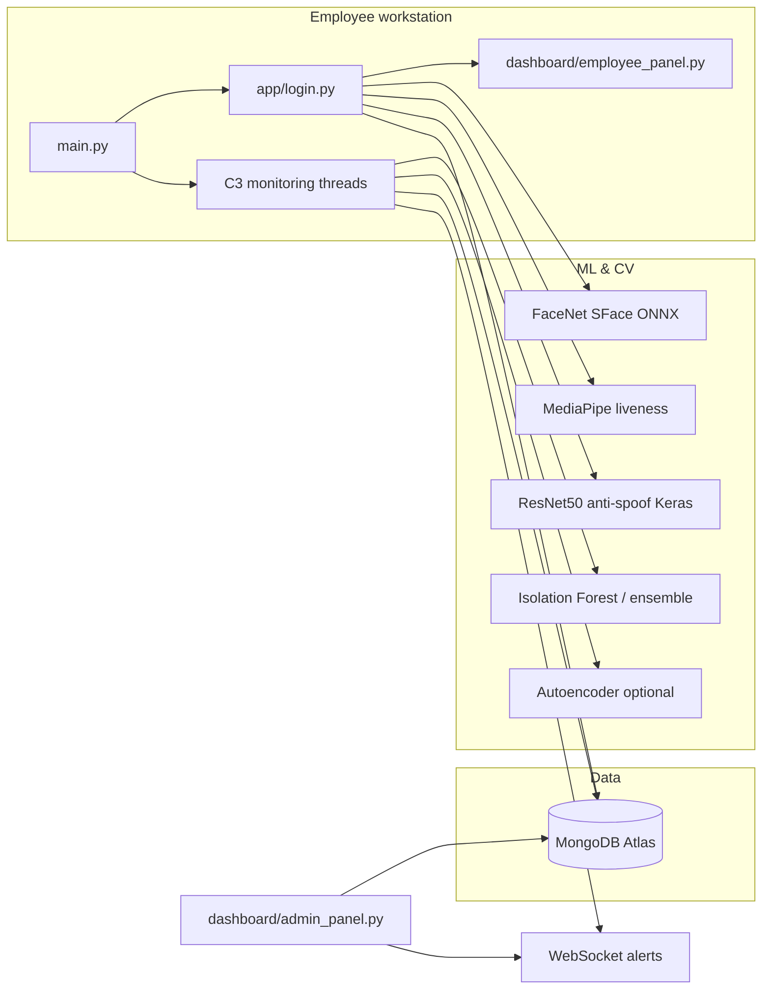

# R26-IT-042 — WorkPlus (Technology-Enabled Employee Tracking & Performance Management)

WorkPlus is a **Python desktop system** for ethical employee activity monitoring and performance insight. The employee experience is built with **CustomTkinter**; data and models are backed by **MongoDB Atlas**; risk signals can be pushed to an **admin dashboard** over **WebSockets**.

This document describes **features by component**, **machine-learning models** (trained vs pre-trained), **main modules and methods**, **data stores**, and **how to run** the project.

---

## Table of contents

1. [High-level architecture](#1-high-level-architecture)
2. [Technology stack](#2-technology-stack)
3. [Repository layout](#3-repository-layout)
4. [Component C1 — User behavioural baseline & attendance anomaly](#4-component-c1--user-behavioural-baseline--attendance-anomaly)
5. [Component C2 — Liveness & anti-spoofing](#5-component-c2--liveness--anti-spoofing)
6. [Component C3 — Activity monitoring & anomaly detection](#6-component-c3--activity-monitoring--anomaly-detection)
7. [Component C4 — Productivity & efficiency prediction](#7-component-c4--productivity--efficiency-prediction)
8. [Application shell: `main.py`, login, employee UI](#8-application-shell-mainpy-login-employee-ui)
9. [Admin dashboard](#9-admin-dashboard)
10. [Shared layer: `common/` and `config/`](#10-shared-layer-common-and-config)
11. [MongoDB collections](#11-mongodb-collections)
12. [Environment configuration (`.env`)](#12-environment-configuration-env)
13. [Setup, run, and build](#13-setup-run-and-build)
14. [Training & evaluation scripts](#14-training--evaluation-scripts)
15. [Known implementation notes & gaps](#15-known-implementation-notes--gaps)

---

## 1. High-level architecture



**Typical session flow**

1. Employee runs `main.py` → config loads from `config/settings.py` (`.env`).
2. **Login** (`app/login.py`): password (bcrypt) → TOTP MFA → face match + liveness (+ optional anti-spoofing).
3. On success: session and auth events are written to MongoDB; **C3** monitoring starts in background threads; **C1** profiling is *intended* to start from `main.py` (see [§15](#15-known-implementation-notes--gaps)).
4. **C3** aggregates keyboard/mouse/app/idle features, scores anomalies, encrypts activity rows, may trigger screenshots and alerts.
5. **Admin** runs `dashboard/admin_panel.py` or `main.py --admin` to view employees, alerts, tasks, attendance, and live risk.

---

## 2. Technology stack

| Layer | Libraries / tools |
|--------|-------------------|
| GUI | `customtkinter`, `Pillow`, `tkcalendar` |
| Database | `pymongo`, `motor` (async-capable client available in deps) |
| Security | `cryptography`, `bcrypt`, `pyotp`, QR MFA (`qrcode[pil]`) |
| Realtime | `websockets`, `websocket-client` |
| Input / OS | `pynput`, `pyautogui`, `psutil` |
| Vision | `opencv-python`, `mediapipe`, `protobuf` (pinned range in `requirements.txt`) |
| ML / stats | `scikit-learn`, `numpy`, `pandas`, `shap` |
| Deep learning | `tensorflow` (C2 anti-spoofing, optional C4 tooling) |
| Geo | `geopy` |
| Packaging | `pyinstaller` |

Full pins: see **`requirements.txt`**. Sub-packages may list extra pins: `C3_activity_monitoring/requirements.txt`, `C2_Anti_Spoofing_Detection/requirements.txt`, `C4_productivity_prediction/requirements.txt`, `C1_user_Behavioural_Baseline/requirements.txt`.

---

## 3. Repository layout

```
R26-IT-042/
├── main.py                      # Desktop entry; starts login, C3, C1/C4 hooks
├── app/
│   └── login.py                 # 3-step auth + face / liveness / lockouts
├── common/                      # DB, encryption, logging, alerts, schemas, commands
├── config/                      # settings.py, break_config.json / break_config.py
├── dashboard/
│   ├── admin_panel.py           # Primary admin GUI (CustomTkinter)
│   ├── employee_panel.py        # Employee dashboard window
│   ├── employee_registration.py
│   ├── app_usage_tracker.py
│   ├── app.py                   # Thin launcher → admin_panel
│   └── templates/               # Legacy HTML (productivity/alerts/index) if used elsewhere
├── C1_user_Behavioural_Baseline/
│   ├── train_model.py           # Isolation Forest + Random Forest on attendance
│   ├── dashboard.py             # CTk UI over behavioural CSV
│   ├── models/                  # Trained *.pkl (IF, RF, encoders, scaler)
│   └── employee_behavior_10000.csv
├── C2_Anti_Spoofing_Detection/
│   ├── src/antispoofing_detector.py
│   └── models/                  # *.keras / weights (see §5)
├── C3_activity_monitoring/
│   ├── src/                     # Runtime trackers, anomaly, logging, breaks, etc.
│   ├── models/                  # Anomaly artifacts + training helpers
│   ├── tests/
│   ├── scripts/
│   └── notebook/
├── C4_productivity_prediction/
│   ├── src/
│   │   ├── efficiency_service.py    # MongoDB → features → joblib classifier
│   │   ├── efficiency_window.py     # CTk UI for efficiency reports
│   │   ├── train_productivity_with_explainability.py
│   │   └── __init__.py              # start_productivity_logger (stub)
│   └── README.md
├── assets/                      # logos, icons
├── setup.bat / setup.sh
├── build.bat / build.sh
├── requirements.txt
└── .env                         # Local secrets (not for git)
```

**Note:** Older docs may refer to `C1_user_interaction/` or `C2_facial_liveness/`. The actual directories in this repo are **`C1_user_Behavioural_Baseline`** and **`C2_Anti_Spoofing_Detection`** (liveness code lives under **`C3_activity_monitoring/src/liveness_detector.py`** and is used at login).

---

## 4. Component C1 — User behavioural baseline & attendance anomaly

### Purpose

- Build **attendance-focused anomaly detection** from MongoDB **`attendance_logs`** (and optional **`activity_logs`** for idle ratio), or from a **synthetic 10k-row** CSV if live data is insufficient.
- Provide a **standalone CustomTkinter dashboard** to browse behavioural CSV data.

### Features

| Feature | Description |
|--------|-------------|
| Dataset builder | `build_attendance_dataset()` pulls `attendance_logs`; merges idle features from `activity_logs` when available. |
| Synthetic fallback | `generate_synthetic_attendance_data()` creates 10k rows and writes `employee_behavior_10000.csv` when Mongo data &lt; 1000 rows. |
| Feature engineering | `login_hour_numeric`, `duration_min`, `idle_ratio`, encoded `location`, encoded `employee_id`. |
| Primary model | **Isolation Forest** with contamination sweep (`calibrate_isolation_forest`). |
| Benchmark model | **Random Forest** classifier (supervised) for comparison / reporting. |
| Artifacts | `StandardScaler`, `LabelEncoder` for location and employee; models saved under **`C1_user_Behavioural_Baseline/models/`** (`isolation_forest.pkl`, `random_forest.pkl`, `scaler.pkl`, `label_encoder_*.pkl`). |

### Main entry points

| Location | Role |
|----------|------|
| `C1_user_Behavioural_Baseline/train_model.py` | `run_training()` — end-to-end training pipeline. |
| `C1_user_Behavioural_Baseline/dashboard.py` | Desktop UI for exploring behaviour CSV (`employee_behavior_10k.csv` path in file — align filename with your data). |

### Integration with `main.py`

`main.py` attempts **`from C1_user_interaction.src import start_interaction_profiling`**. That package path is **not present** in this repository (see [§15](#15-known-implementation-notes--gaps)). C1 still delivers value as **offline training + dashboard** under `C1_user_Behavioural_Baseline/`.

---

## 5. Component C2 — Liveness & anti-spoofing

### 5.1 MediaPipe liveness (`LivenessDetector`)

**Path:** `C3_activity_monitoring/src/liveness_detector.py`

| Feature | Method / behaviour |
|--------|---------------------|
| Blink detection | Eye Aspect Ratio (EAR) on MediaPipe Face Mesh landmarks; configurable `ear_threshold`, `min_blinks`. |
| Head movement | Nose-tip displacement across frames vs `head_move_threshold`. |
| Session analysis | Collects ~`ANALYSIS_FRAMES` frames; exposes result with `passed`, blink count, `liveness_score`. |
| Consumers | `app/login.py` (step 3), `break_manager.py` (post-break return). |

**Class:** `LivenessDetector` — `process_frame()`, `get_result()` (see file for full API).

### 5.2 Anti-spoofing (deep model)

**Path:** `C2_Anti_Spoofing_Detection/src/antispoofing_detector.py`

| Item | Detail |
|------|--------|
| Architecture | **ResNet50-based** Keras model; binary real vs fake. |
| Default weights | `C2_Anti_Spoofing_Detection/models/best_anti_spoofing_model.keras` |
| Input | Face crop preprocessed to **96×96 RGB**. |
| API | `AntiSpoofingDetector.load_model()`, `preprocess_frame()`, prediction helpers (score interpreted as fake likelihood — see module docstring). |
| Other files in `models/` | e.g. `face_anti_spoofing_resnet50.keras`, `model.weights.h5` (compatibility / alternates). |

**Shared utilities:** `common/antispoofing_utils.py` (e.g. camera check flows used from `break_manager.py`).

### 5.3 Face verification (embedding match)

**Path:** `C3_activity_monitoring/src/face_verifier.py`

| Item | Detail |
|------|--------|
| Model | OpenCV **FaceRecognizerSF** with **`face_recognition_sface.onnx`** (SFace / 128-D embedding). |
| Methods | `get_embedding()`, `verify()` with cosine similarity. |
| Dependency | Requires **`opencv-contrib-python`** for `cv2.FaceRecognizerSF` (see module error messages). |

Login thresholds and hit counts are configured in **`app/login.py`** (e.g. `_FACENET_THRESHOLD`, `_FACE_VERIFY_HITS_REQUIRED`).

---

## 6. Component C3 — Activity monitoring & anomaly detection

### Purpose

Continuously capture **keyboard**, **mouse**, **foreground application**, and **idle** signals; roll them into **ML features**; compute **risk scores**; persist encrypted **activity logs**; optionally **screenshot**, **alert** (WebSocket + MongoDB), and respect **scheduled breaks**.

### Orchestration

| Function | File | Role |
|----------|------|------|
| `start_monitoring(...)` | `C3_activity_monitoring/src/initialize_monitoring.py` | Starts trackers, `FeatureExtractor`, `AnomalyEngine`, `ActivityLogger`, `BreakManager`, `ScreenshotTrigger`, `OfflineQueue`, websocket alerting. |

**Parameters include:** `user_id`, `db_client`, `alert_sender`, `shutdown_event`, `session_id`, `location_mode`, `location_context`, `wifi_ssid_match`, `face_liveness_score`.

### Runtime modules (feature map)

| Module | Responsibility |
|--------|----------------|
| `keyboard_tracker.py` | Keystroke timing, WPM, dwell/flight stats. |
| `mouse_tracker.py` | Velocity, acceleration, curvature, clicks, scroll. |
| `app_usage_monitor.py` | Active window / app switching, focus duration, entropy. |
| `idle_detector.py` | Idle periods vs `IDLE_THRESHOLD_SEC`. |
| `app_usage_analytics.py` | Deeper analytics over app usage (supporting reports). |
| `feature_extractor.py` | **`FeatureExtractor.extract()`** — builds **27-field** dict (see docstring): includes temporal, interaction, app, session, geo/WiFi/device fingerprint, liveness score. |
| `anomaly_engine.py` | **`AnomalyEngine.load_model()`**, **`score(features)`** → risk **0–100**; optional AE + meta LR + isotonic stacker path. |
| `activity_logger.py` | ~60s loop: extract → score → label → **AES encrypt** feature vector → **HMAC** → insert `activity_logs` or `OfflineQueue`; screenshot after consecutive high risk. |
| `break_manager.py` | Schedules lunch + short breaks; UI countdown; pauses trackers; **liveness / anti-spoof** on return; overrun → `policy_violations` + alerts. |
| `screenshot_trigger.py` | Captures screen on anomaly policy. |
| `offline_queue.py` | Buffers when DB unavailable. |
| `websocket_alerter.py` | Sends structured alerts to dashboard. |
| `geo_context.py` | Geolocation context for features. |
| `session_monitor.py` | Session-level monitoring helpers. |

### Anomaly ML — models and files

**Runtime class:** `AnomalyEngine` (`C3_activity_monitoring/src/anomaly_engine.py`)

**Canonical feature order (19 columns for the model):**  
`FEATURE_COLUMNS` in `anomaly_engine.py` — e.g. `mean_dwell_time`, `std_dwell_time`, `typing_speed_wpm`, mouse stats, `idle_ratio`, app switch rate, `active_app_entropy`, `session_duration_min`, `geolocation_deviation`, `wifi_ssid_match`, `device_fingerprint_match`, `face_liveness_score`, etc.

**Primary persisted artifacts (under `C3_activity_monitoring/models/`):**

| File | Role |
|------|------|
| `user_behavioral_model.pkl` | **Required** for scoring — trained **IsolationForest** (pickle). |
| `feature_scaler.pkl` | **StandardScaler** (or compatible) — strongly recommended. |
| `ae_model.pkl` | Optional **sklearn MLPRegressor**-style autoencoder for reconstruction error. |
| `ae_scaler.pkl` | Optional separate scaler for AE path (falls back to feature scaler). |
| `ae_threshold.pkl` | Threshold for AE reconstruction signal. |
| `ensemble_config.json` | Weights / thresholds for IF+AE blend (see note in [§15](#15-known-implementation-notes--gaps)). |
| `composite_iso.pkl` | Optional isotonic calibrator on composite risk. |
| `meta_lr.pkl` | Optional **logistic regression** meta-model on normalized IF/AE risks. |
| `supervised_stacker.pkl`, `supervised_stacker_iso.pkl`, `supervised_config.json` | Optional supervised stacking path with config-driven feature count and threshold. |

The repo may ship **`.placeholder`** files for `user_behavioral_model.pkl` / `feature_scaler.pkl` — replace with real pickles after training.

**Secondary / research loader:** `C3_activity_monitoring/models/ensemble_engine.py` documents an alternate naming pair **`if_model.pkl`** + **`ae_model.pkl`** + **`if_scaler.pkl`** for batch scoring and experiments (`load_engine()`, `score_batch`, etc.). Use **one consistent naming strategy** for production (either align filenames with `AnomalyEngine` or adjust paths).

**Training & evaluation code (selection):**

| Script | Purpose |
|--------|---------|
| `models/train_isolation_forest.py` | Train IF pipeline. |
| `models/train_autoencoder.py` | Train AE (MLP regressor) pipeline. |
| `models/isolation_forest_model.py`, `autoencoder_model.py` | Model construction helpers. |
| `models/dataset_handler.py` | Dataset IO / prep. |
| `notebook/train_models.py` | Notebook-style training / metrics (referenced from `models/README.md`). |
| `scripts/evaluate_models.py`, `scripts/temporal_validation.py`, `scripts/upgrade_robust_models.py`, `scripts/pilot_logger.py` | Evaluation, validation, upgrades, pilot logging. |

**Documented metrics:** See **`C3_activity_monitoring/models/README.md`** for precision/recall/F1/AUC summaries for IF, AE, weighted ensemble, and meta logistic regression.

### Risk & alerting behaviour (summary)

- `ActivityLogger` uses soft/hard thresholds (defaults **50** / **75**), maps to labels `normal` / `low_risk_anomaly` / `high_risk_anomaly`.
- Consecutive high-risk windows can trigger **screenshots** (`SCREENSHOT_CONSECUTIVE_THRESHOLD`).
- `AlertSender` (`common/alerts.py`) maps scores to **LOW / MEDIUM / HIGH / CRITICAL** and sends JSON over WebSocket (`WEBSOCKET_URL`), with secure logger fallback.

---

## 7. Component C4 — Productivity & efficiency prediction

### Purpose

- **Batch / admin-facing** efficiency predictions driven by MongoDB **`employees`**, **`tasks`**, and **`activity_logs`**, using a trained **scikit-learn** pipeline loaded via **joblib**.
- Optional **training with explainability** (SHAP + LIME) from a tabular CSV.

### Features

| Feature | Location | Notes |
|--------|----------|------|
| Efficiency prediction service | `C4_productivity_prediction/src/efficiency_service.py` | Class **`EfficiencyPredictionService`**: `load()`, `predict_all(db_client, period_start, period_end)`, report builders (`EmployeeEfficiencyResult`, `EmployeeProductivityReport`). |
| Admin UI window | `efficiency_window.py`, `launch_efficiency_window.py` | CustomTkinter views over the service. |
| Training | `train_productivity_with_explainability.py` | **RandomForestClassifier** (300 trees, `class_weight="balanced"`) inside **`Pipeline`**: `ColumnTransformer` (OneHot categoricals + numeric passthrough) → RF. Exports reports + SHAP + LIME artifacts under `outputs/`. Expects `employee_productivity_dataset.csv` beside the script. |
| Runtime hook from `main.py` | `C4_productivity_prediction/src/__init__.py` | **`start_productivity_logger()`** currently **waits on shutdown only** (stub — no periodic inference). |

### Models (expected after training)

| Artifact | Path (default) |
|----------|----------------|
| Classifier | `C4_productivity_prediction/src/productivity_classifier.joblib` |
| Label encoder | `C4_productivity_prediction/src/label_encoder.joblib` |

These files are **not always committed**; generate them by running the training script and copying artifacts into the expected names/paths, or configure `EfficiencyPredictionService(model_path=..., label_encoder_path=...)`.

### Target & features (training script)

- Target column: **`performance_label`**.
- Drops identifiers / free text columns (`record_id`, `task_id`, names, descriptions, etc.).
- Date columns (`join_date`, `assigned_date`, `deadline_date`) converted to **day offsets**.

---

## 8. Application shell: `main.py`, login, employee UI

### `main.py`

- Resolves paths, optionally **re-execs** into `.venv` Python on Windows.
- Parses CLI (`--admin`, etc.).
- Boots **CustomTkinter** employee flow: after authentication, opens **`dashboard/employee_panel.py`** and starts **C3** via `start_monitoring`.
- Starts background threads for **C1** and **C4** entry points (see [§15](#15-known-implementation-notes--gaps)).

### `app/login.py` — three-step authentication

| Step | Mechanism |
|------|-----------|
| 1 | Employee ID + password (**bcrypt**); lockout after failed attempts (`_PW_LOCKOUT_MINUTES`). |
| 2 | **TOTP** MFA (`pyotp`), QR setup as per UI flow. |
| 3 | **Webcam** face verification (FaceNet/SFace ONNX via `FaceVerifier`) + **MediaPipe liveness** + optional **anti-spoofing**; face failure lockout (`_FACE_LOCKOUT_MINUTES`); critical alert path documented in module docstring. |

On success: creates **`sessions`**, logs **`auth_events`**, wires **`MongoDBClient`** and **`AlertSender`**.

---

## 9. Admin dashboard

**Primary app:** `dashboard/admin_panel.py` (**CustomTkinter**)

Documented sections:

- **Dashboard** — live overview, risk colouring.
- **Alerts** — WebSocket-fed alert stream and management.
- **Tasks** — assignment UI (`tkcalendar` when installed).
- **Attendance** — filtered attendance log views.
- **Settings** — app configuration.

**Launch:**

- `python dashboard/admin_panel.py`
- `python dashboard/app.py` (delegates to `launch_admin_panel`)
- `python main.py --admin`

**Legacy note:** `dashboard/app.py` states the older Flask web dashboard was superseded by this desktop admin. **`dashboard/routes.py`** is a stub for future Flask/FastAPI route extraction.

---

## 10. Shared layer: `common/` and `config/`

### `common/`

| Module | Responsibility |
|--------|----------------|
| `database.py` | `MongoDBClient` — connect, `get_collection`, known collection names. |
| `models.py` | Dataclasses: `SessionDocument`, `AlertDocument`, `ScreenshotDocument`, `BehavioralBaselineDocument`, `AuthEventDocument`, `ProductivityDocument`, etc. |
| `encryption.py` | AES / crypto helpers for sensitive payloads. |
| `logger.py` | Secure / structured logging. |
| `alerts.py` | `AlertSender` — WebSocket delivery + fallback. |
| `commands.py` | Remote command document handling. |
| `email_utils.py` | SMTP helpers (see `settings.SMTP_*`). |
| `antispoofing_utils.py` | Anti-spoofing capture / latest-check helpers. |

### `config/`

| File | Role |
|------|------|
| `settings.py` | Central `_Settings` / `settings` singleton: Mongo, AES, WebSocket, thresholds, screenshot dirs, intervals, SMTP. |
| `break_config.json` | Encrypted break schedule consumed by `BreakManager`. |
| `break_config.py` | Helpers for break configuration. |

---

## 11. MongoDB collections

Authoritative schema-style definitions: **`common/models.py`**.  
`MongoDBClient.KNOWN_COLLECTIONS` (in `common/database.py`) includes:

`sessions`, `alerts`, `screenshots`, `behavioral_baselines`, `auth_events`, `productivity_scores`, `employees`, `tasks`, `task_logs`, `activity_logs`, `attendance_logs`, `policy_violations`, `commands`, `camera_streams`, `screen_streams`, `antispoofing_checks`.

---

## 12. Environment configuration (`.env`)

Loaded by `config/settings.py` via `python-dotenv`. Typical variables:

| Variable | Purpose |
|----------|---------|
| `MONGO_URI` | MongoDB connection string (**required**). |
| `MONGO_DB_NAME` | Database name (default `employee_monitor`). |
| `AES_KEY` | **64 hex chars** (32-byte key) for field encryption (**required**). |
| `WEBSOCKET_URL` | Alert WebSocket URL (default `ws://localhost:8765`). |
| `APP_NAME`, `VERSION` | Metadata. |
| `ANOMALY_THRESHOLD`, `RISK_SCORE_SOFT_WARNING`, `RISK_SCORE_HARD_WARNING` | Risk tuning. |
| `BREAK_LUNCH_MINUTES`, `BREAK_SHORT_MINUTES` | Break defaults. |
| `SCREENSHOT_INTERVAL_SEC`, `SCREENSHOT_DIR` | Screenshot behaviour. |
| `KEYBOARD_SAMPLE_INTERVAL`, `MOUSE_SAMPLE_INTERVAL`, `IDLE_CHECK_INTERVAL`, `IDLE_THRESHOLD_SEC` | Monitoring cadence. |
| `SMTP_HOST`, `SMTP_PORT`, `SMTP_USER`, `SMTP_PASS` | Email. |

---

## 13. Setup, run, and build

### Setup

- **Windows:** `setup.bat`
- **Unix/macOS:** `chmod +x setup.sh && ./setup.sh`

### Run (examples)

- Employee app: `python main.py` (or `start_employee.bat` if provided on your machine).
- Admin: `python main.py --admin` or `python dashboard/admin_panel.py`.

### Build standalone binary

- **Windows:** `build.bat`
- **Unix/macOS:** `./build.sh`  
Uses **PyInstaller** (see scripts for entry points and flags).

### Face model download

If SFace ONNX is missing, follow the URL / instructions in `face_verifier.py` module docstring or use `download_facenet_model.py` at project root when applicable.

---

## 14. Training & evaluation scripts

| Area | Command / file |
|------|------------------|
| C1 attendance anomaly | `python C1_user_Behavioural_Baseline/train_model.py` |
| C3 IF / AE / ensemble | `python C3_activity_monitoring/models/train_isolation_forest.py`, `train_autoencoder.py`, `notebook/train_models.py`, `models/ensemble_engine.py` (smoke) |
| C4 productivity + XAI | `python C4_productivity_prediction/src/train_productivity_with_explainability.py` (requires CSV) |
| Tests | `python -m pytest C3_activity_monitoring/tests/` (install pytest if needed) |

---

## 15. Known implementation notes & gaps

1. **`main.py` imports `C1_user_interaction`** — this folder is **not** in the repository; C1 code lives under **`C1_user_Behavioural_Baseline`**. Until an adapter package is added, the C1 thread logs a warning and skips.
2. **`start_productivity_logger`** in `C4_productivity_prediction/src/__init__.py` is a **stub** (sleep until shutdown). Real C4 value today is **`EfficiencyPredictionService`** + admin efficiency windows.
3. **Model files** for C3/C4 may be **missing or placeholder** in a fresh clone — train or copy artifacts before expecting non-zero anomaly scores or efficiency predictions.
4. **Dual naming** for C3 pickles: `AnomalyEngine` expects `user_behavioral_model.pkl`; `ensemble_engine.py` documents `if_model.pkl` — keep naming consistent in deployment.
5. **`ensemble_config.json`** keys include `best_weight` / `best_threshold` (research export), while `AnomalyEngine` reads `weight` / `threshold` — verify config compatibility when tuning ensembles.

---

## Team component map (research)

| ID | Topic | Primary location in repo |
|----|--------|---------------------------|
| C1 | Behavioural / attendance ML | `C1_user_Behavioural_Baseline/` |
| C2 | Anti-spoofing DL | `C2_Anti_Spoofing_Detection/` |
| C3 | Live monitoring + anomaly | `C3_activity_monitoring/` |
| C4 | Productivity / efficiency | `C4_productivity_prediction/` |

---

## License & ethics

This system handles **biometric-adjacent data**, **keystroke dynamics**, and **screen capture**. Deploy only with **explicit policy**, **employee consent**, **least-privilege access**, **retention limits**, and jurisdiction-compliant privacy review. The codebase includes ethical framing in module docstrings; organisational policy must back it.
